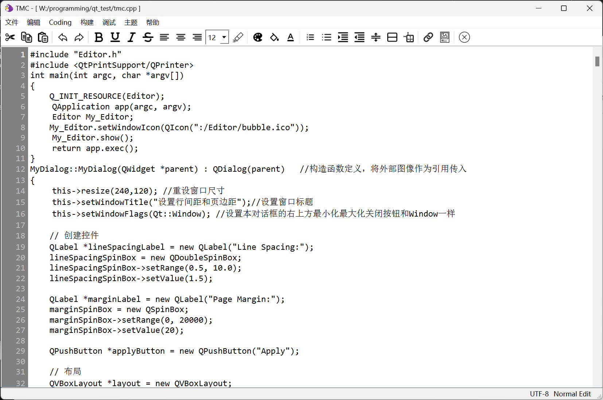
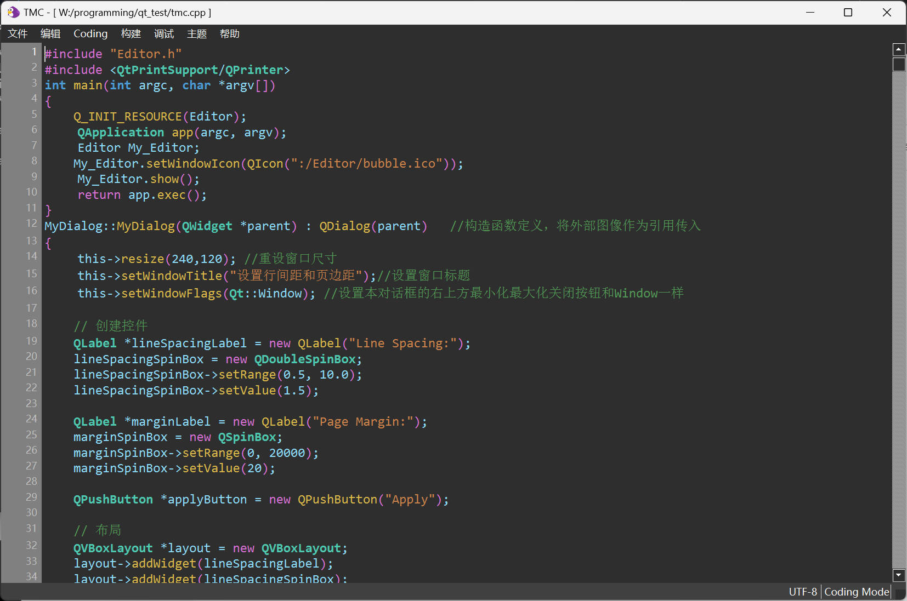

## 文本编辑器tmc

### 基本介绍

该本文编辑器基于Qt6.6.1开发(包含Qt5compat模块)，能够实现基本的文本编辑功能以及基本的代码编辑功能

- 支持不同编码格式文本文件的打开
- 支持基本文本操作，如(复制、粘贴、加粗、斜体等)
- 支持文件的导出与保存(PDF,MarkDown,Html)
- 支持小规格图片的插入
- 支持C，C++代码代码编辑，语法高亮
- 支持代码的编译以及与运行

### 目录结构

- release文件夹放置编译中间文件和最后可执行文件
- Editor文件夹放置图标文件
- tmc.cpp和Editor.h为程序文件，Editor.qrc为嵌入式资源文件，img.res为应用图标图标
- qt_test.pro用于qmake生成makefile

### 使用界面介绍

正常文本编辑模式

代码编辑模式

---

此程序为一次课程作业，比较简陋，仅供参考。